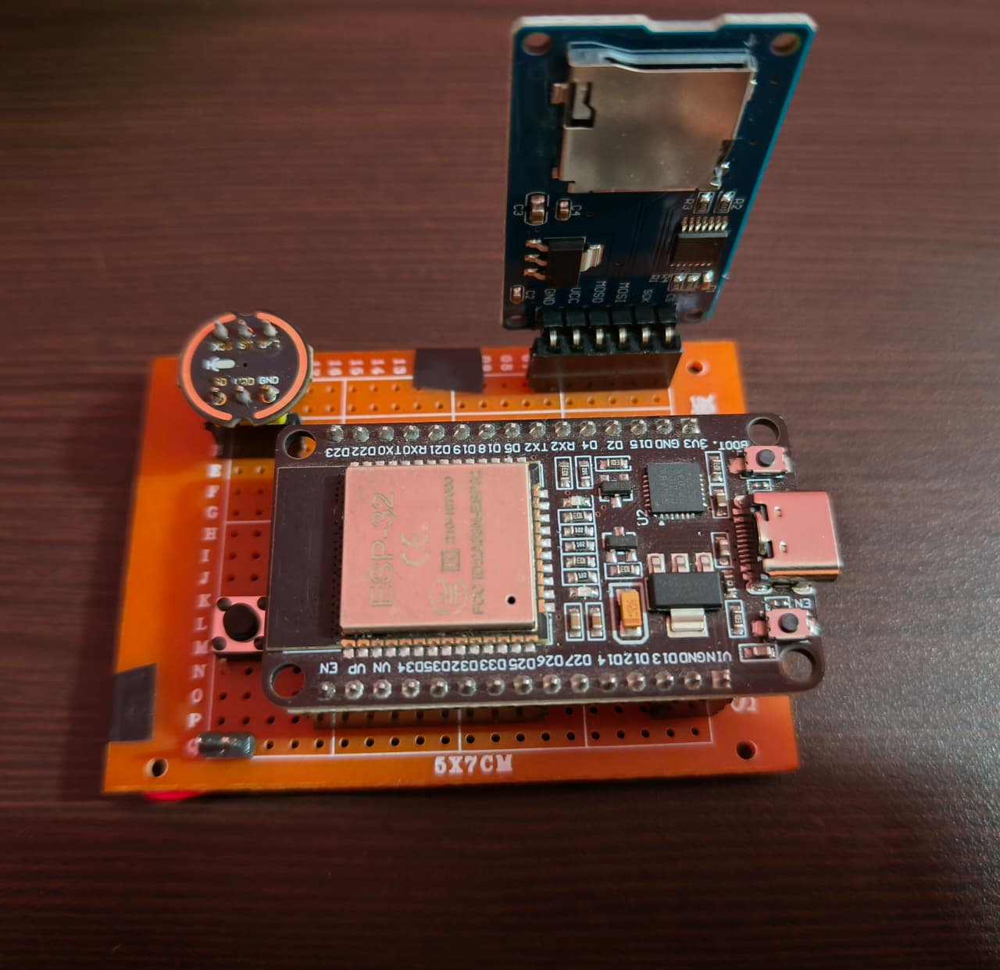

# ESP32-Based Wi-Fi Voice Recorder

A compact IoT voice recorder using **ESP32, INMP441 microphone, and MicroSD storage**. Audio is recorded as WAV files using a push button and can be accessed through a **Wi-Fi web server** from a phone or PC.

### Features

* INMP441 digital microphone
* Push-button recording
* WAV storage on MicroSD
* ESP32 Wi-Fi connectivity
* Web interface to play/download recordings

### Tech Stack

**ESP32 • INMP441 • MicroSD • I²S • SPI • Wi-Fi • Arduino IDE**
